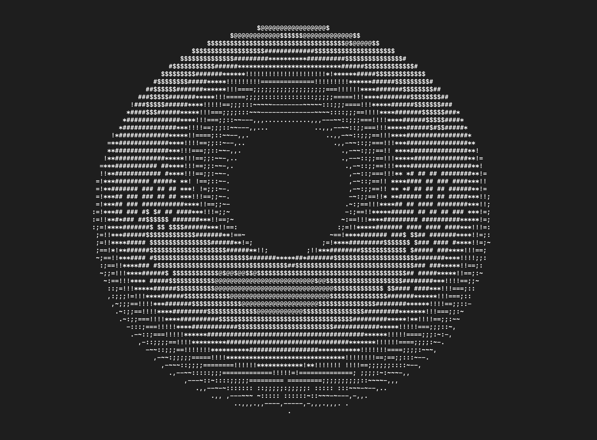
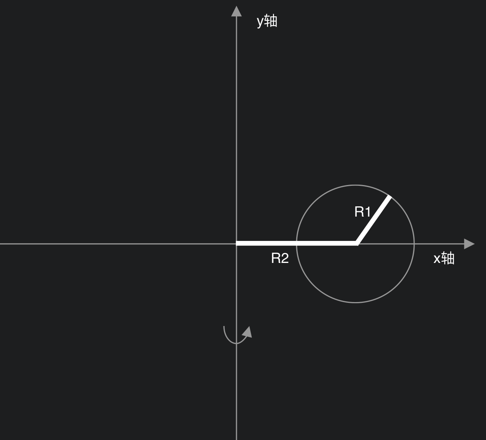

<!--加载MathJax的最新文件， async表示异步加载进来 -->

# go-donut

## 获取控制台窗口大小

---

由于控制台中的字符高宽不是1:1，所以打印字符的时候需要使用到控制台的 行数与高度像素的比值 和 列数与宽度像素的比值。

代码中使用了` "golang.org/x/sys/unix"`包来获取上述比值。

## 如何画出一个donut

---

donut是通过一个圆绕着一个圆外的轴旋转 $2\pi$ 而成, 如图：

所以圆的公式为：$(x,y)=(R2+R1\times cos(\theta), R1\times sin(\theta))$

环是由圆绕着y轴旋转而来，所以可以使用y轴旋转矩阵计算：
$$
(x,y,z) = (R2 + R1\cdot \cos(\theta), R1\cdot \sin(\theta), 0)
\cdot
\left[
  \begin{matrix}
    \cos(\phi)&0&\sin(\phi) \\
    0&1&0 \\
    -\sin(\phi)&0&\cos(\phi)
  \end{matrix}
\right]
$$

如果需要绕着x轴和z轴也旋转，那么，环的公式就变成了(其中A，B为自定义的旋转角)：
$$
(x,y,z) = 
(R2 + R1\cdot \cos(\theta), R1\cdot \sin(\theta), 0)
\cdot
\left[
  \begin{matrix}
    \cos(\phi)&0&\sin(\phi) \\
    0&1&0 \\
    -\sin(\phi)&0&\cos(\phi)
  \end{matrix}
\right]
\cdot
\left[
  \begin{matrix}
    1&0&0\\
    0&\cos(A)&-\sin(A)\\
    0&\sin(A)&\cos(A)
  \end{matrix}
\right]
\cdot
\left[
  \begin{matrix}
    \cos(B)&-\sin(B)&0 \\
    \sin(B)&\cos(B)&0 \\
    0&0&1
  \end{matrix}
\right]
$$
化简得：
$$
x = 
(R2 + R1\cos(\theta)) \cdot (\cos(\phi)\cos(B) + \sin(\phi)\sin(A)\sin(B)) - 
R1\sin(\theta)\cos(A)\sin(B)\\
y =
(R2 + R1\cos(\theta)) \cdot (\cos(\phi)\sin(B) - \sin(\phi)\sin(A)\cos(B)) +
R1\sin(\theta)\cos(A)\cos(B)\\
z = 
(R2 + R1\cos(\theta))\sin(\phi)\cos(A)+R1\sin(\theta)\sin(A)
$$
将 $\theta$ 和 $\phi$ 从 0 转到  $2\pi$ , 选定A、B的值，再将(x,y,z)坐标填上字符就可以得到一个donut了！

## 添加光影

---

​	要给donut添加上阴影，添加一个光源并且计算出donut上每个点朝向光源的程度、添加上对应光强的字符就可以了。

​	首先，我们先确定光线的方向，例如（0，1，-1）-从视角的顶上往下照射。计算面向量（平面圆上点的向量乘以三个对应的旋转矩阵）：
$$
(N_x,N_y,N_z) = 
(\cos(\theta), \sin(\theta), 0)
\cdot
\left[
  \begin{matrix}
    \cos(\phi)&0&\sin(\phi) \\
    0&1&0 \\
    -\sin(\phi)&0&\cos(\phi)
  \end{matrix}
\right]
\cdot
\left[
  \begin{matrix}
    1&0&0\\
    0&\cos(A)&-\sin(A)\\
    0&\sin(A)&\cos(A)
  \end{matrix}
\right]
\cdot
\left[
  \begin{matrix}
    \cos(B)&-\sin(B)&0 \\
    \sin(B)&\cos(B)&0 \\
    0&0&1
  \end{matrix}
\right]
$$
​	然后再计算donut上每个点所在面上的法向量 N 与光线向量的内积L （$-\sqrt2 < L < \sqrt2$）：
$$
L=
\cos(\theta)\cos(\phi)\sin(B) +
\sin(\theta)\cos(A)\cos(B) - \\
\cos(\theta)\sin(\phi)\sin(A)\cos(B) -
\sin(\theta)\sin(A) - 
\cos(\theta)\sin(\phi)\cos(A)
$$
​    $L<0$ 说明该点背向光线，$L>0$说明该点朝向光线且L的大小代表光线强度

​	最后我们用  `.,-~:;=!*#$@` 这几个符号代表光强即可勾勒出donut上的光影

